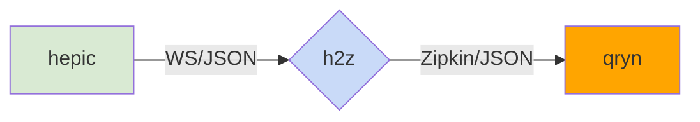

<a href="https://hepic.cloud"></a>

# h2Z
[hepic](https://hepic.cloud) zipkin trace emitter for [qryn](https://qryn.cloud)

### Status
- Experimental

### Parameters
- `WS_PORT`: Listening Websocket Port
- `HTTP_ENDPOINT`: Zipkin/Tempo HTTP Push API _(/tempo/api/push)_
- `MAX_CACHE`: Buffer Cache in Seconds
- `ALLCDRS` :  Set to true to capture all CDRs _(without flag it captures Status > 10)_

### Usage
```
 HTTP_ENDPOINT="http://qryn:3100/tempo/api/push" node h2z.js
```

<br>

### Workflow


### Example


