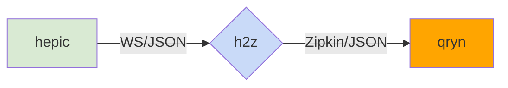

# h2z
HEPIC TDR to Zipkin Trace relay

## Status
- Experimental

## Workflow

```mermaid
flowchart LR

A[hepic] -->|WS/JSON| C{h2z}
C -->|Zipkin/JSON| D[qryn]


style A fill:#d9ead3ff
style D fill:#FFA500ff
style C fill:#c9daf8ff
```

## Screenshots

