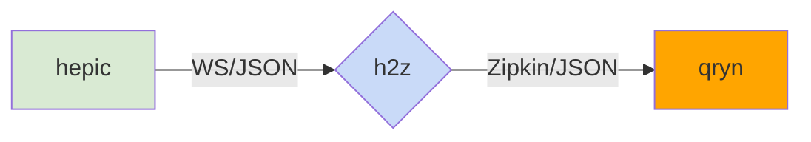

# h2z
HEPIC TDR to Zipkin Trace relay

### Status
- Experimental

### Parameters
- `WS_PORT`: Listening Websocket Port
- `HTTP_ENDPOINT`: Zipkin/Tempo HTTP Push API _(/tempo/api/push)_
- `MAX_CACHE`: Buffer Cache in Seconds

 

### Workflow

### Example

